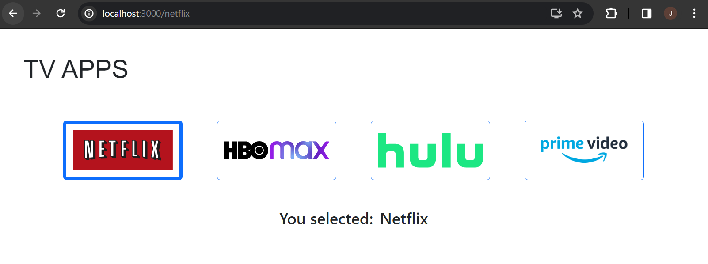

# web603-hw-w7d2

## Walkthrough

Create the app "router-params" by
```bash
$ npx create-react-app router-params
```

With `router-params/` as the current directory, install the following dependencies by
```bash
$ npm install bootstrap react-router-dom
```

Key parts of the code:

1. Clicking an app icon is directed to the corresponding URL path.

2. Use `useParams` to get the app-id from the URL path, for the string "You selected: ${app-id}.".

3. Use React state to track which icon has been clicked and then apply a different style to that icon.

## Test
### App Home


### Clicking on App Icons

Clicking on Netflix:


Clicking on HBO Max:


Clicking on Hulu:


Clicking on Prime Video:

